# 📁 Abstract Wallpapers

Collection of 129 wallpapers in the Abstract category.

## üìä Category Statistics
- **Number of Wallpapers:** 129
- **Total Size:** 171.57 MB
- **Last Updated:** 2025-05-12 09:50:02 UTC

## üìë Navigation
- [⬆️ Back to Main Collection](../../README.md)

## üìã Wallpaper List

| Thumbnail | File Name | Size (MB) |
|-----------|-----------|-----------|
|  | [1.jpg](1.jpg) | 0.15 |
|  | [10.png](10.png) | 7.75 |
|  | [100.png](100.png) | 1.01 |
|  | [101.jpg](101.jpg) | 1.87 |
|  | [102.png](102.png) | 5.94 |
|  | [103.jpg](103.jpg) | 0.17 |
|  | [104.jpeg](104.jpeg) | 4.49 |
| 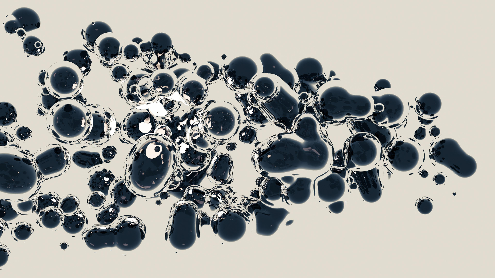 | [105.jpg](105.jpg) | 0.68 |
| 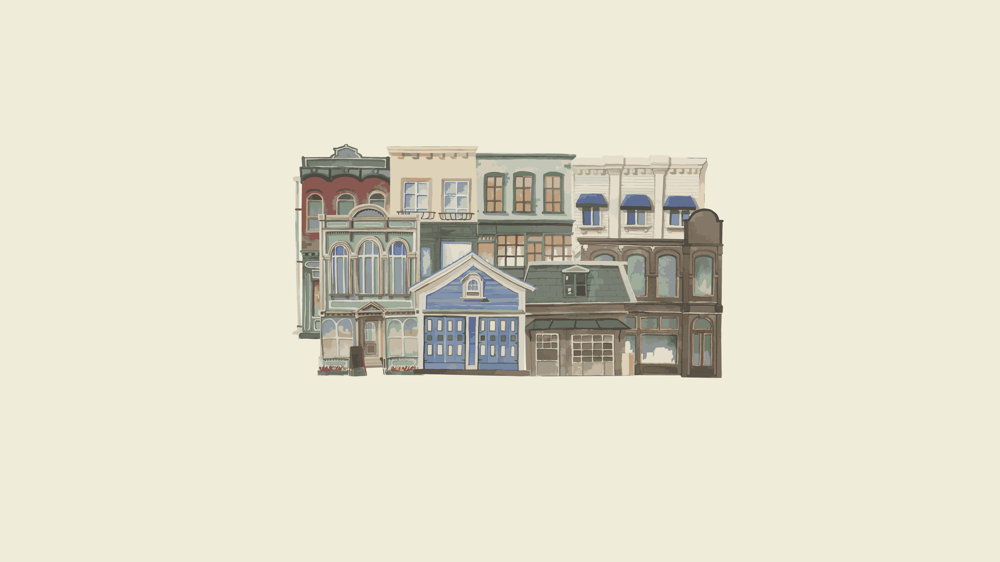 | [106.png](106.png) | 3.2 |
|  | [107.jpg](107.jpg) | 0.53 |
|  | [108.jpeg](108.jpeg) | 0.1 |
|  | [109.jpg](109.jpg) | 0.45 |
|  | [11.png](11.png) | 17.22 |
| 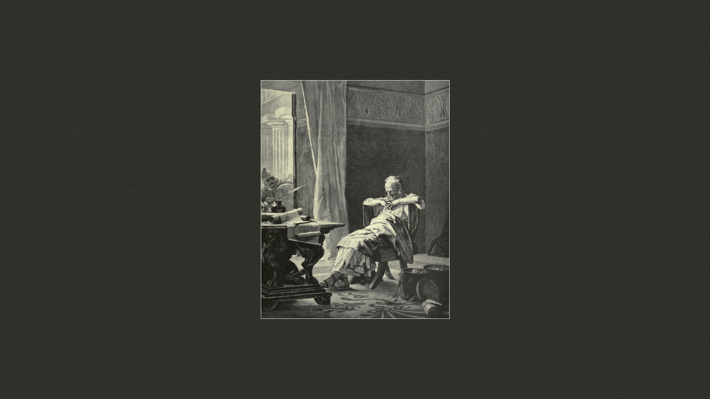 | [110.png](110.png) | 1.51 |
|  | [111.jpg](111.jpg) | 5.6 |
| 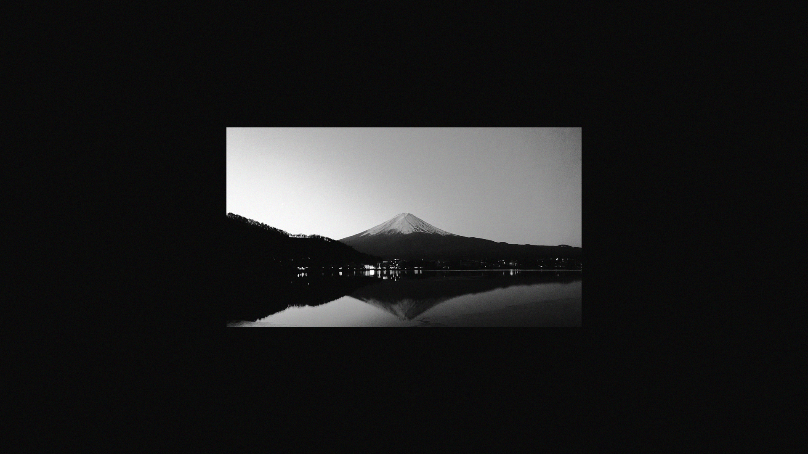 | [112.jpg](112.jpg) | 2.02 |
| 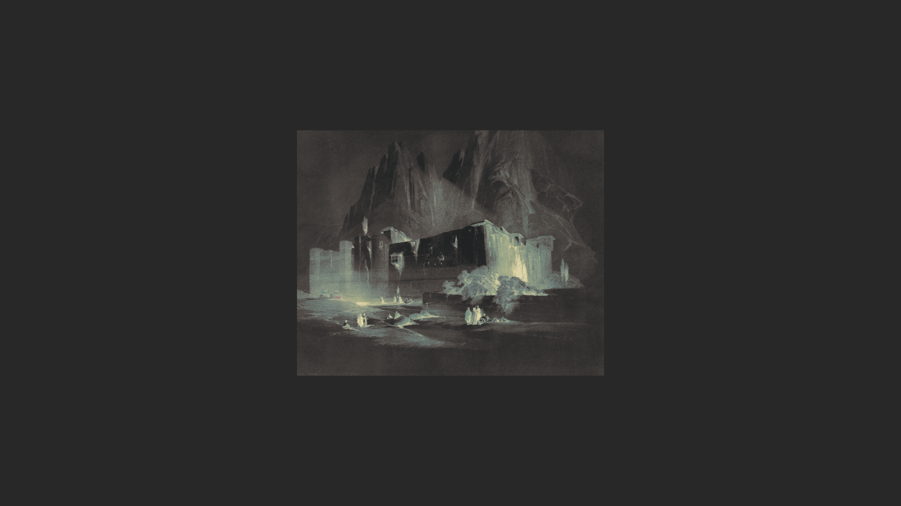 | [113.png](113.png) | 1.05 |
| 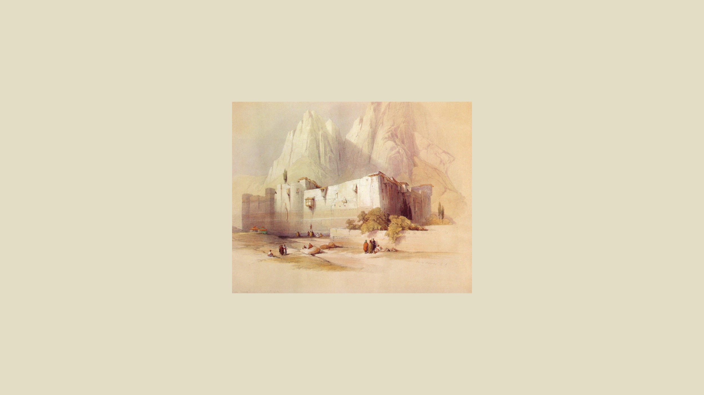 | [114.png](114.png) | 1.43 |
|  | [115.jpg](115.jpg) | 2.08 |
|  | [116.png](116.png) | 0.81 |
| 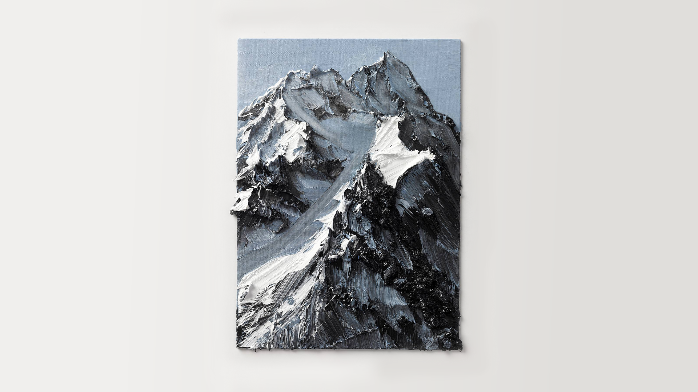 | [117.png](117.png) | 1.42 |
|  | [118.png](118.png) | 0.23 |
|  | [119.png](119.png) | 0.43 |
|  | [12.jpg](12.jpg) | 0.04 |
| 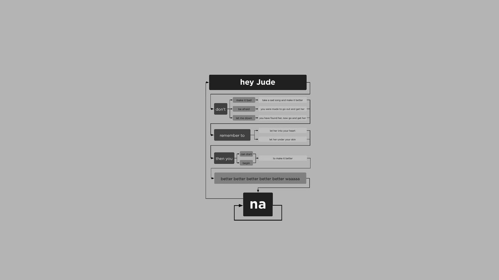 | [120.jpg](120.jpg) | 0.07 |
|  | [121.png](121.png) | 1.29 |
|  | [122.png](122.png) | 2.2 |
| 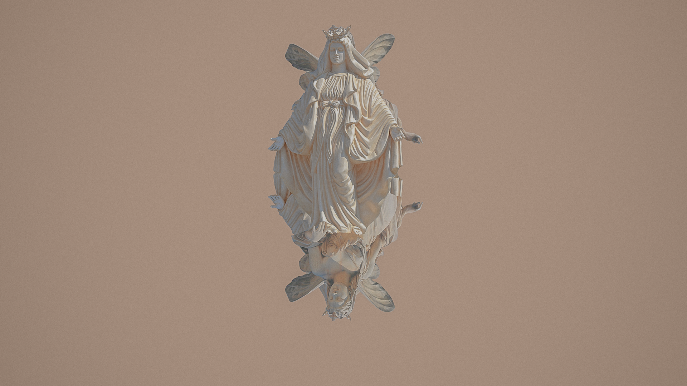 | [123.png](123.png) | 2.13 |
| 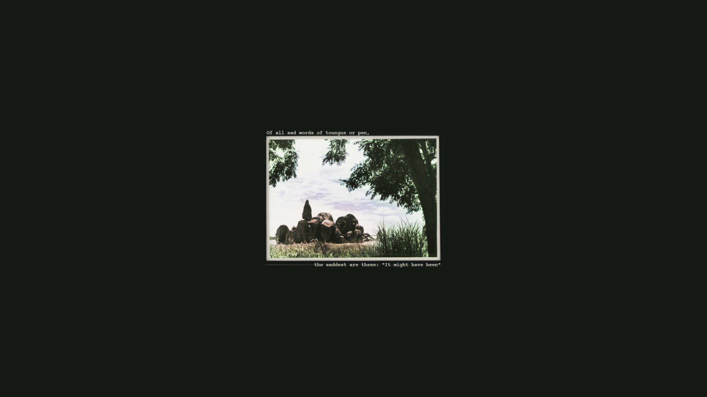 | [124.png](124.png) | 0.5 |
|  | [125.jpg](125.jpg) | 0.17 |
|  | [126.jpg](126.jpg) | 0.28 |
| 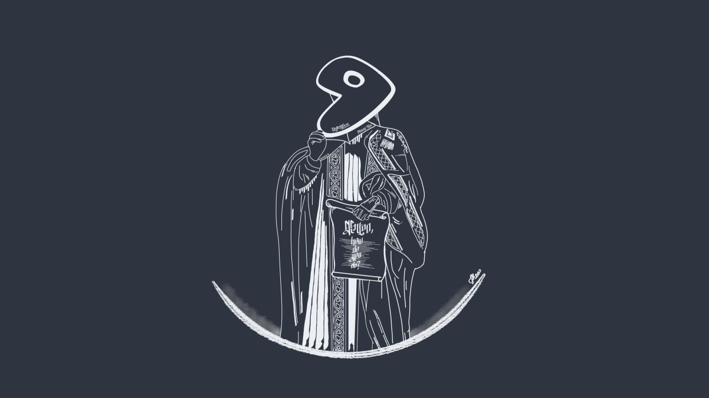 | [127.png](127.png) | 0.15 |
| 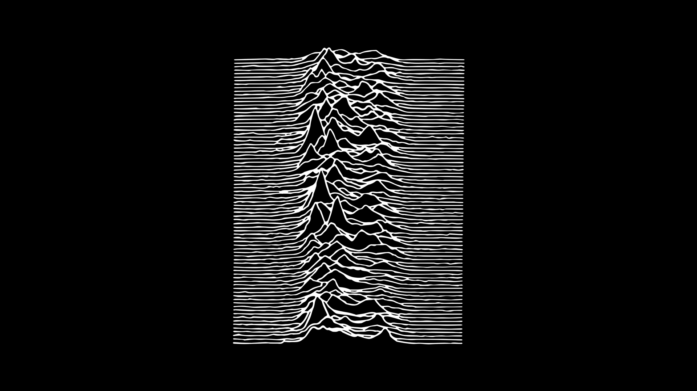 | [128.jpg](128.jpg) | 0.41 |
| 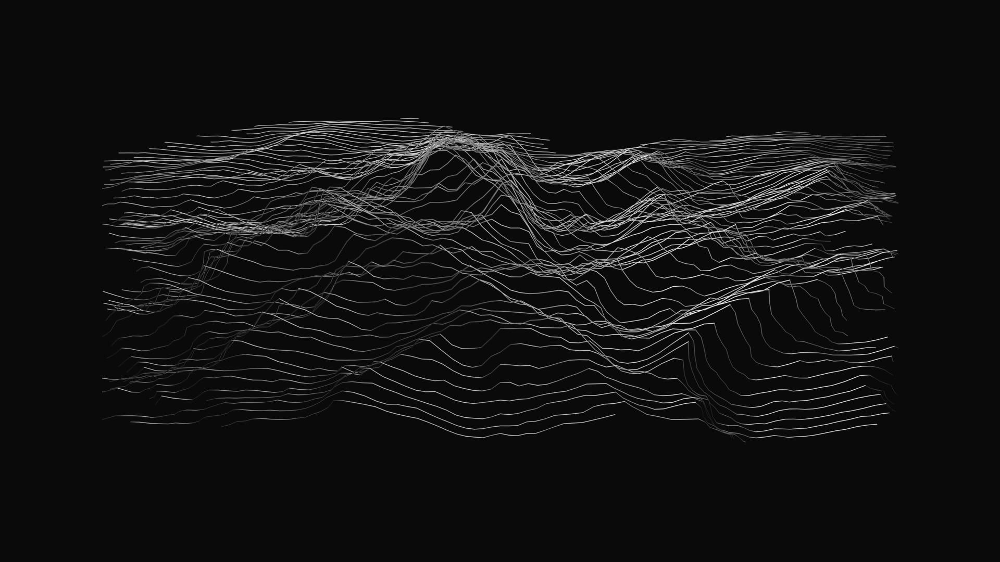 | [129.jpeg](129.jpeg) | 0.18 |
|  | [13.png](13.png) | 3.6 |
|  | [130.png](130.png) | 0.15 |
|  | [131.png](131.png) | 0.41 |
| 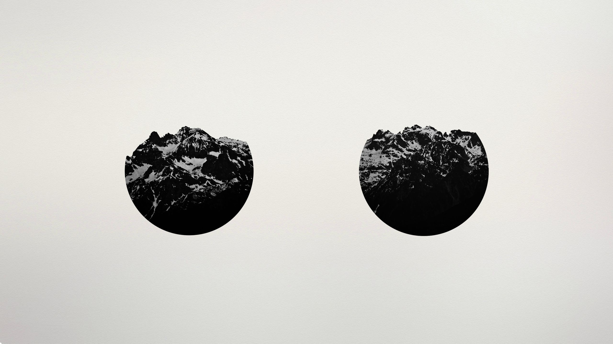 | [132.jpg](132.jpg) | 0.52 |
|  | [14.jpg](14.jpg) | 0.55 |
|  | [15.jpg](15.jpg) | 2.9 |
|  | [16.png](16.png) | 1.57 |
| 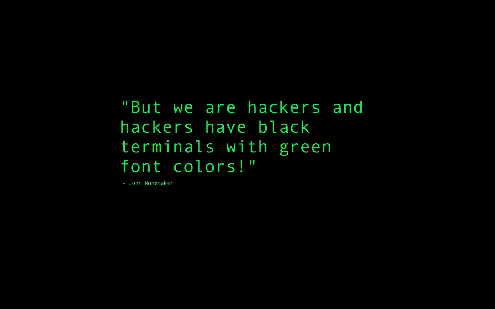 | [17.jpg](17.jpg) | 0.07 |
|  | [18.jpg](18.jpg) | 0.4 |
|  | [19.jpg](19.jpg) | 1.12 |
|  | [2.jpg](2.jpg) | 1.87 |
|  | [20.png](20.png) | 0.34 |
|  | [21.png](21.png) | 1.8 |
|  | [22.png](22.png) | 0.04 |
|  | [23.png](23.png) | 7.92 |
|  | [24.jpg](24.jpg) | 2.06 |
|  | [25.png](25.png) | 5.59 |
|  | [26.png](26.png) | 0.77 |
| 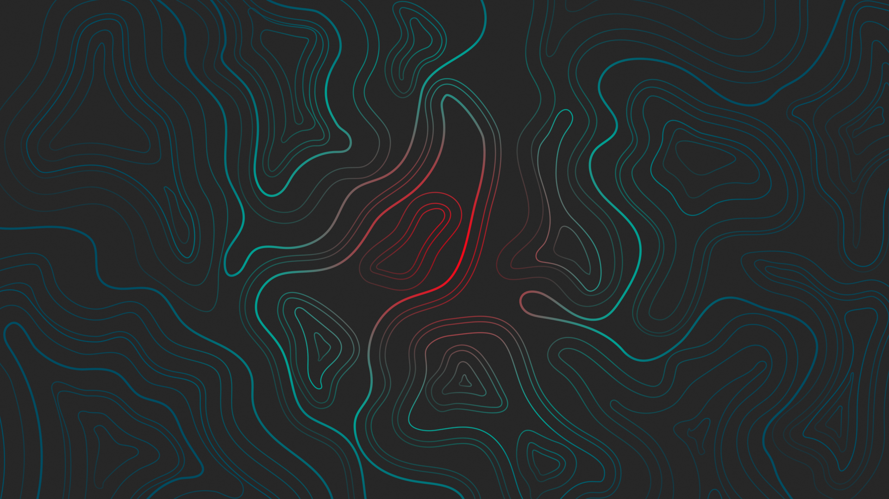 | [27.jpg](27.jpg) | 1.13 |
| 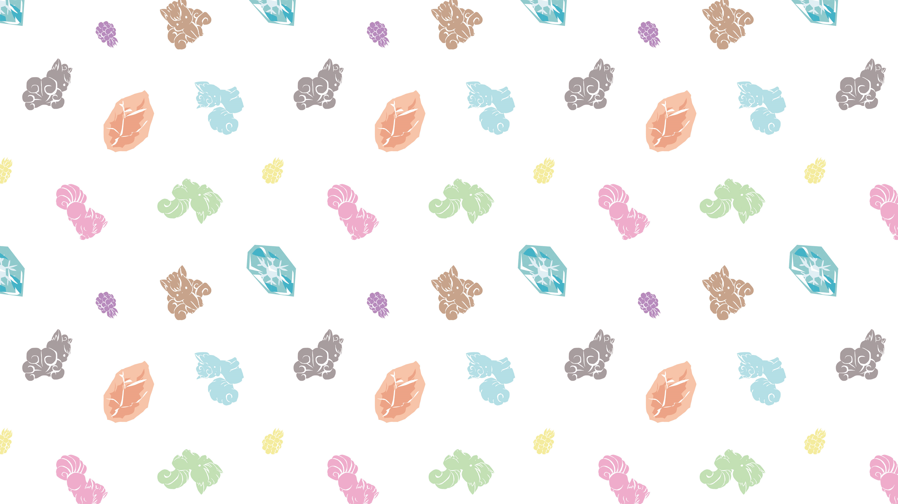 | [28.png](28.png) | 0.8 |
|  | [29.png](29.png) | 7.94 |
|  | [30.png](30.png) | 3.81 |
|  | [31.jpg](31.jpg) | 0.36 |
|  | [32.jpg](32.jpg) | 0.81 |
|  | [33.jpg](33.jpg) | 0.57 |
|  | [34.png](34.png) | 1.04 |
|  | [35.jpg](35.jpg) | 0.28 |
|  | [36.jpg](36.jpg) | 0.94 |
|  | [37.jpg](37.jpg) | 7.78 |
|  | [38.jpg](38.jpg) | 0.14 |
|  | [39.png](39.png) | 0.3 |
|  | [4.jpg](4.jpg) | 3.69 |
|  | [40.jpg](40.jpg) | 2.09 |
|  | [41.jpeg](41.jpeg) | 1.74 |
|  | [42.png](42.png) | 0.12 |
|  | [43.jpg](43.jpg) | 0.03 |
|  | [44.png](44.png) | 0.14 |
|  | [45.jpg](45.jpg) | 0.03 |
| 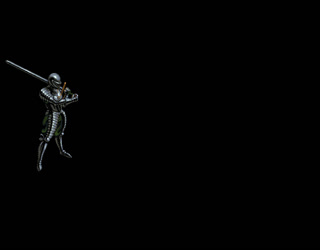 | [46.jpg](46.jpg) | 0.0 |
|  | [47.jpg](47.jpg) | 0.0 |
|  | [48.jpg](48.jpg) | 0.01 |
|  | [49.jpg](49.jpg) | 1.95 |
|  | [5.png](5.png) | 0.01 |
|  | [50.jpg](50.jpg) | 0.01 |
| 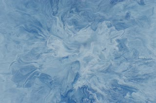 | [51.jpg](51.jpg) | 0.01 |
|  | [52.jpg](52.jpg) | 0.02 |
|  | [53.png](53.png) | 0.0 |
| 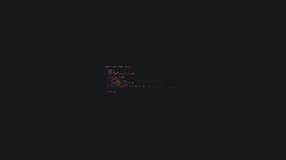 | [54.png](54.png) | 0.0 |
|  | [55.png](55.png) | 0.0 |
|  | [56.jpg](56.jpg) | 0.01 |
|  | [57.jpg](57.jpg) | 0.03 |
|  | [58.jpg](58.jpg) | 0.01 |
|  | [59.png](59.png) | 0.05 |
|  | [6.png](6.png) | 0.01 |
|  | [60.jpg](60.jpg) | 6.72 |
| 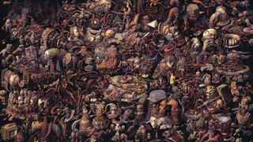 | [61.png](61.png) | 0.14 |
|  | [62.jpg](62.jpg) | 0.0 |
| 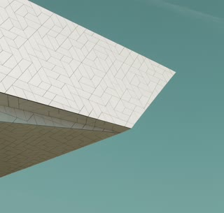 | [63.jpg](63.jpg) | 0.01 |
|  | [64.png](64.png) | 0.06 |
|  | [65.jpg](65.jpg) | 0.0 |
|  | [66.jpg](66.jpg) | 0.01 |
|  | [67.jpg](67.jpg) | 0.01 |
|  | [68.png](68.png) | 0.07 |
|  | [69.png](69.png) | 0.05 |
|  | [7.jpg](7.jpg) | 1.3 |
|  | [70.jpg](70.jpg) | 0.01 |
|  | [71.png](71.png) | 1.64 |
| 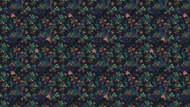 | [72.png](72.png) | 0.09 |
|  | [73.jpg](73.jpg) | 1.61 |
|  | [74.png](74.png) | 0.02 |
|  | [75.png](75.png) | 0.03 |
|  | [76.png](76.png) | 0.11 |
|  | [77.png](77.png) | 0.13 |
|  | [78.jpg](78.jpg) | 0.0 |
|  | [79.jpg](79.jpg) | 0.01 |
|  | [80.jpg](80.jpg) | 0.02 |
|  | [81.jpg](81.jpg) | 0.0 |
|  | [82.jpg](82.jpg) | 0.01 |
|  | [83.png](83.png) | 0.49 |
|  | [84.jpg](84.jpg) | 1.35 |
|  | [85.jpg](85.jpg) | 0.02 |
|  | [86.png](86.png) | 7.92 |
| 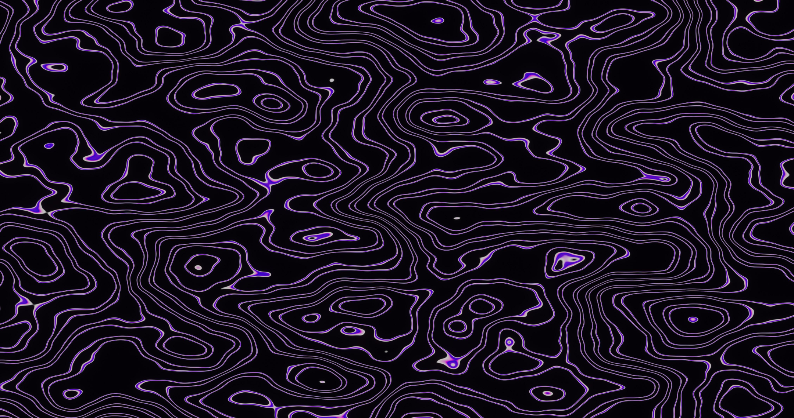 | [87.png](87.png) | 3.78 |
|  | [88.jpg](88.jpg) | 1.13 |
|  | [89.jpg](89.jpg) | 0.58 |
|  | [90.png](90.png) | 0.38 |
| 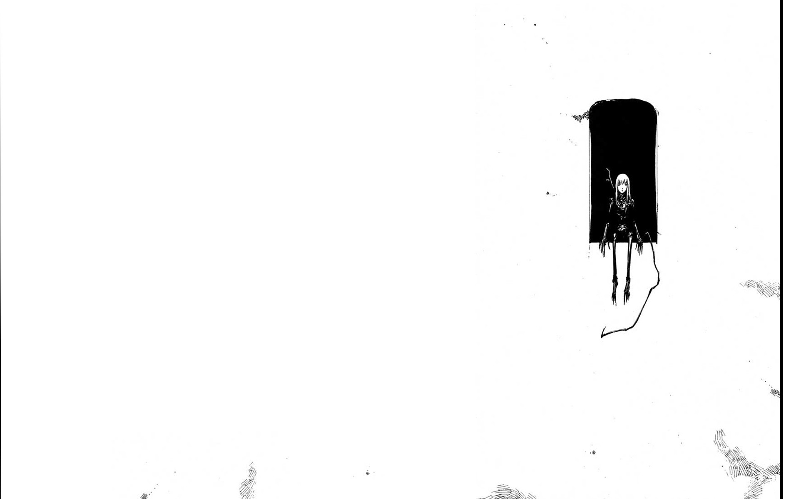 | [91.jpg](91.jpg) | 0.08 |
| 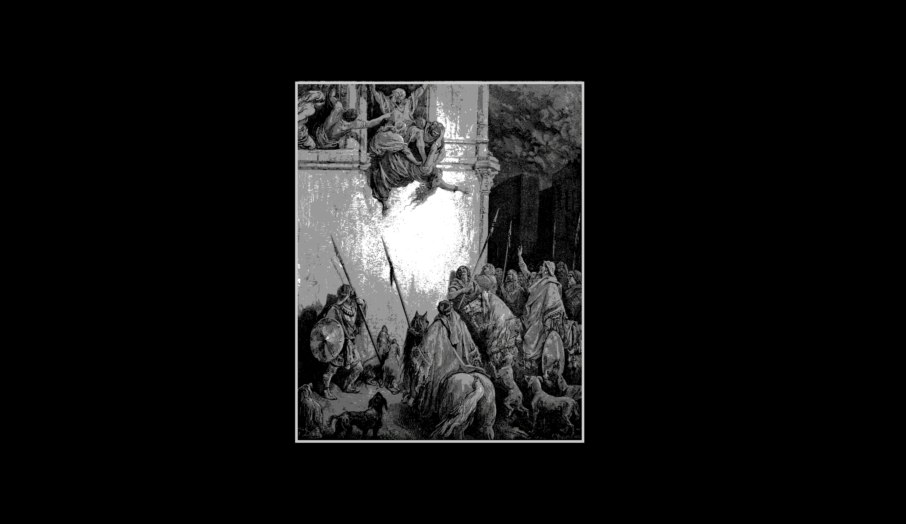 | [92.png](92.png) | 0.2 |
|  | [93.png](93.png) | 0.27 |
| 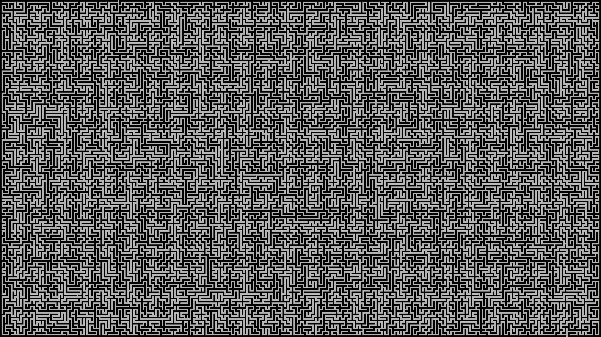 | [94.png](94.png) | 0.26 |
| 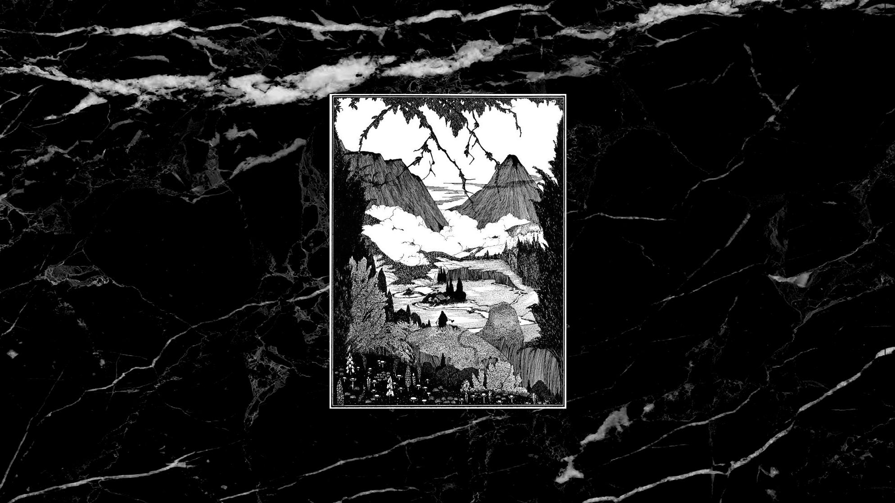 | [95.png](95.png) | 1.39 |
|  | [96.jpg](96.jpg) | 0.39 |
|  | [97.jpg](97.jpg) | 5.75 |
|  | [98.jpg](98.jpg) | 0.24 |
| 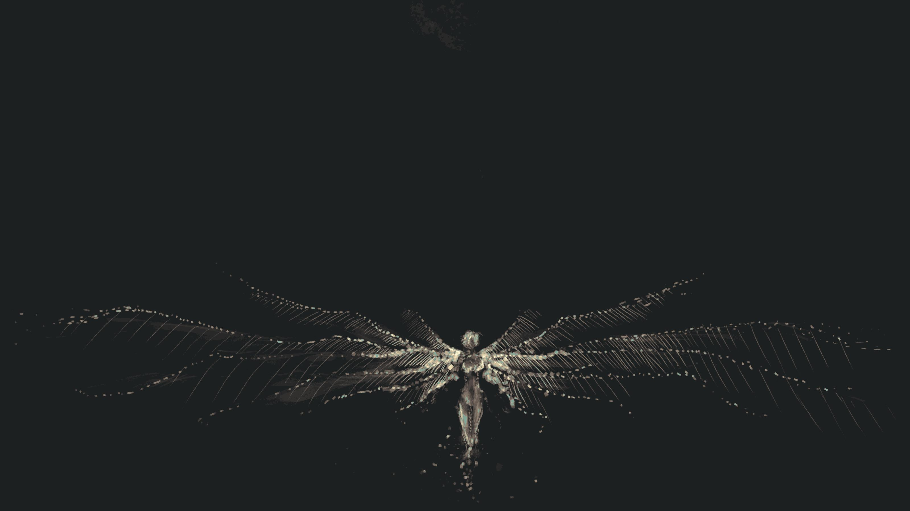 | [99.jpg](99.jpg) | 0.19 |

## 🔄 Update Information
- **Updated at:** 2025-05-12 09:50:02 UTC
- **Updated by:** [SpreadSheets600](https://github.com/SpreadSheets600)

---
Generated by [SpreadSheets600](https://github.com/SpreadSheets600)'s Wallpaper Collection Manager
