# 📁 Nord Wallpapers

Collection of 191 wallpapers in the Nord category.

## üìä Category Statistics
- **Number of Wallpapers:** 191
- **Total Size:** 340.49 MB
- **Last Updated:** 2025-05-12 09:50:02 UTC

## üìë Navigation
- [⬆️ Back to Main Collection](../../README.md)

## üìã Wallpaper List

| Thumbnail | File Name | Size (MB) |
|-----------|-----------|-----------|
|  | [1.jpg](1.jpg) | 0.05 |
|  | [10.png](10.png) | 0.22 |
|  | [100.png](100.png) | 0.29 |
|  | [101.png](101.png) | 0.7 |
|  | [102.png](102.png) | 0.34 |
|  | [103.png](103.png) | 1.48 |
|  | [104.png](104.png) | 0.07 |
|  | [105.png](105.png) | 0.14 |
|  | [106.png](106.png) | 0.08 |
|  | [107.png](107.png) | 0.13 |
| 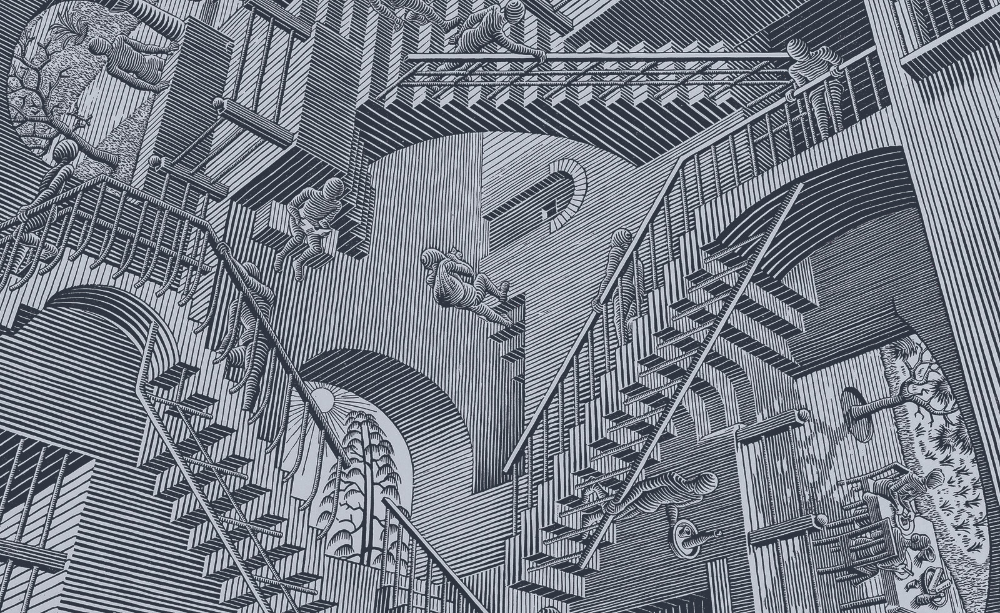 | [108.jpg](108.jpg) | 0.8 |
|  | [109.png](109.png) | 0.22 |
|  | [11.png](11.png) | 43.0 |
|  | [110.png](110.png) | 0.25 |
| 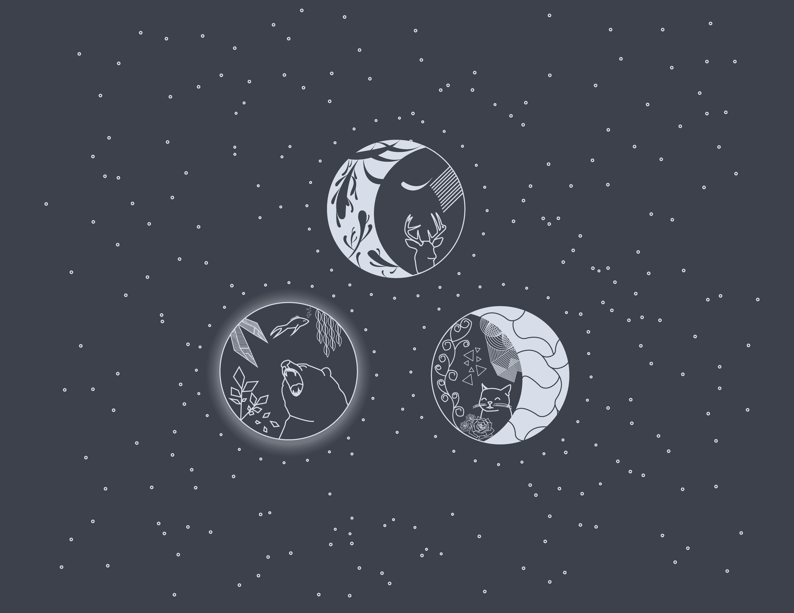 | [111.png](111.png) | 0.35 |
|  | [112.jpg](112.jpg) | 0.72 |
|  | [113.png](113.png) | 0.46 |
|  | [114.png](114.png) | 0.1 |
|  | [115.png](115.png) | 1.66 |
|  | [116.jpg](116.jpg) | 0.2 |
|  | [117.png](117.png) | 0.07 |
|  | [118.png](118.png) | 1.74 |
|  | [119.png](119.png) | 2.23 |
|  | [12.png](12.png) | 0.46 |
|  | [120.png](120.png) | 2.75 |
|  | [121.png](121.png) | 1.53 |
|  | [122.png](122.png) | 1.81 |
|  | [123.png](123.png) | 0.86 |
|  | [124.jpg](124.jpg) | 0.21 |
| 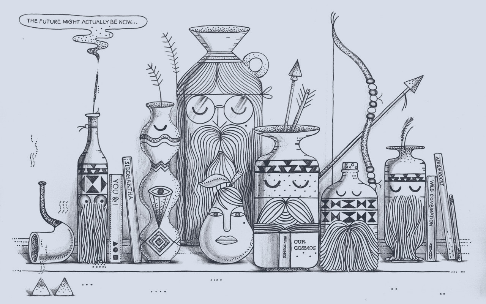 | [125.jpg](125.jpg) | 0.22 |
|  | [126.png](126.png) | 0.31 |
| 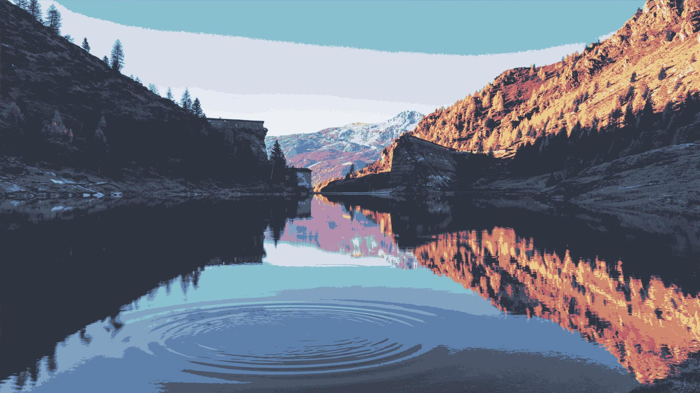 | [127.jpg](127.jpg) | 0.22 |
|  | [128.png](128.png) | 0.53 |
|  | [129.png](129.png) | 1.94 |
|  | [13.png](13.png) | 9.33 |
| 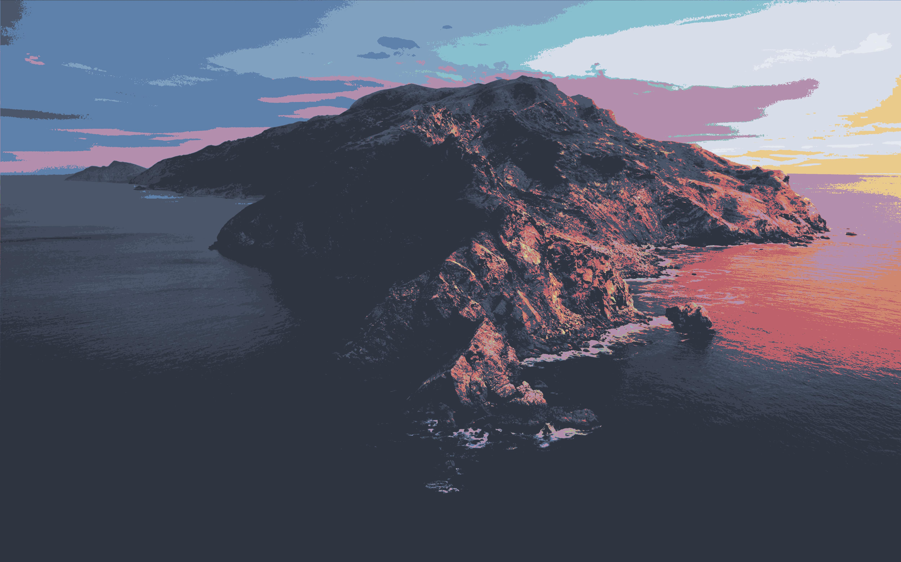 | [130.jpg](130.jpg) | 0.99 |
|  | [131.jpg](131.jpg) | 6.14 |
|  | [132.jpg](132.jpg) | 0.05 |
|  | [133.png](133.png) | 0.07 |
|  | [134.png](134.png) | 0.25 |
|  | [135.png](135.png) | 0.18 |
|  | [136.png](136.png) | 0.03 |
|  | [137.png](137.png) | 0.09 |
|  | [138.png](138.png) | 0.11 |
|  | [139.png](139.png) | 0.04 |
|  | [14.png](14.png) | 0.25 |
| 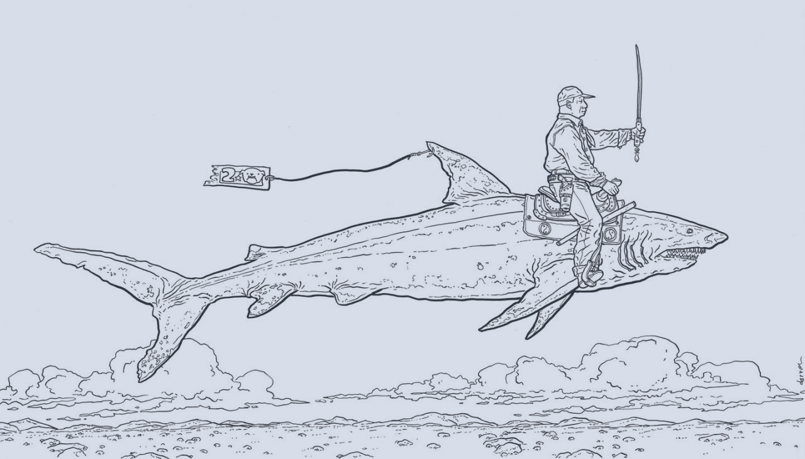 | [140.jpg](140.jpg) | 0.13 |
| 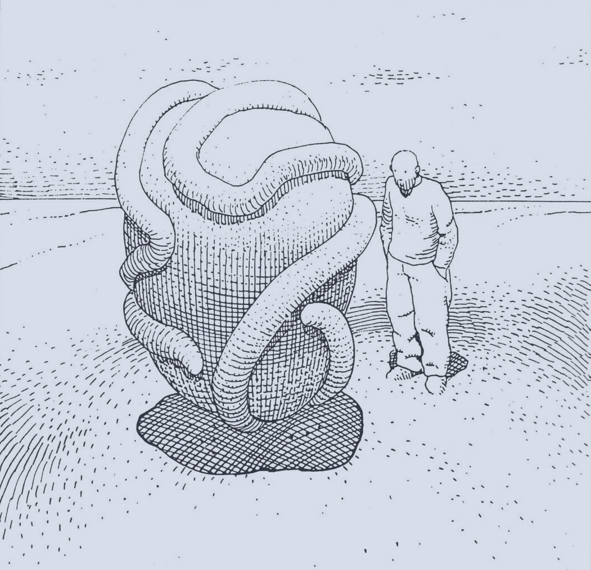 | [141.jpg](141.jpg) | 0.28 |
|  | [142.png](142.png) | 0.15 |
|  | [143.png](143.png) | 0.11 |
|  | [144.png](144.png) | 0.22 |
|  | [145.jpg](145.jpg) | 5.13 |
|  | [146.jpg](146.jpg) | 3.99 |
|  | [147.png](147.png) | 0.69 |
|  | [148.png](148.png) | 15.08 |
|  | [149.png](149.png) | 6.66 |
|  | [15.jpg](15.jpg) | 4.53 |
|  | [150.png](150.png) | 0.31 |
|  | [151.jpg](151.jpg) | 0.13 |
|  | [152.png](152.png) | 0.21 |
| 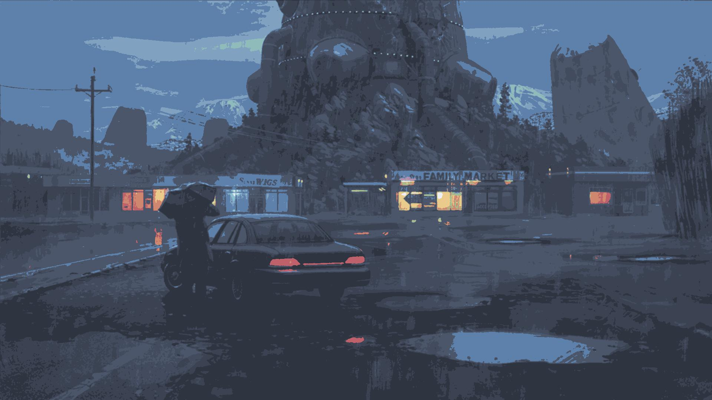 | [153.jpg](153.jpg) | 0.15 |
|  | [154.png](154.png) | 0.24 |
|  | [155.png](155.png) | 0.24 |
|  | [156.png](156.png) | 0.97 |
|  | [157.jpg](157.jpg) | 2.45 |
|  | [158.png](158.png) | 7.39 |
| 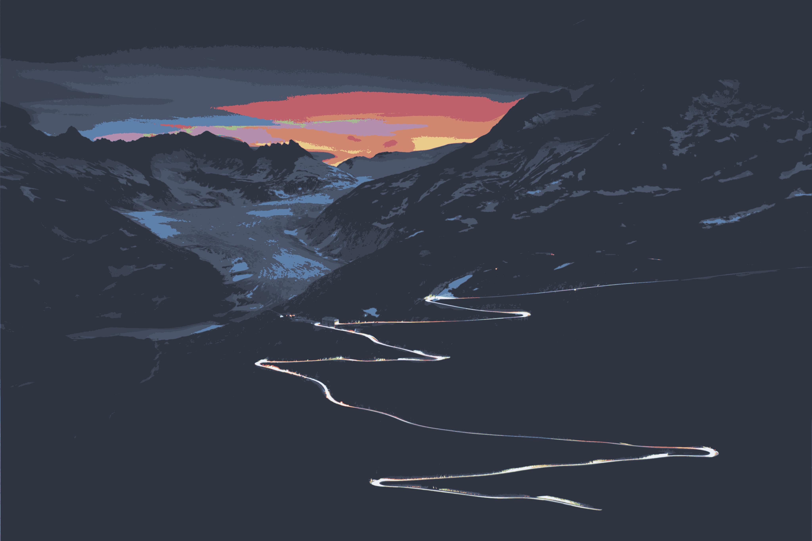 | [159.jpg](159.jpg) | 0.36 |
| 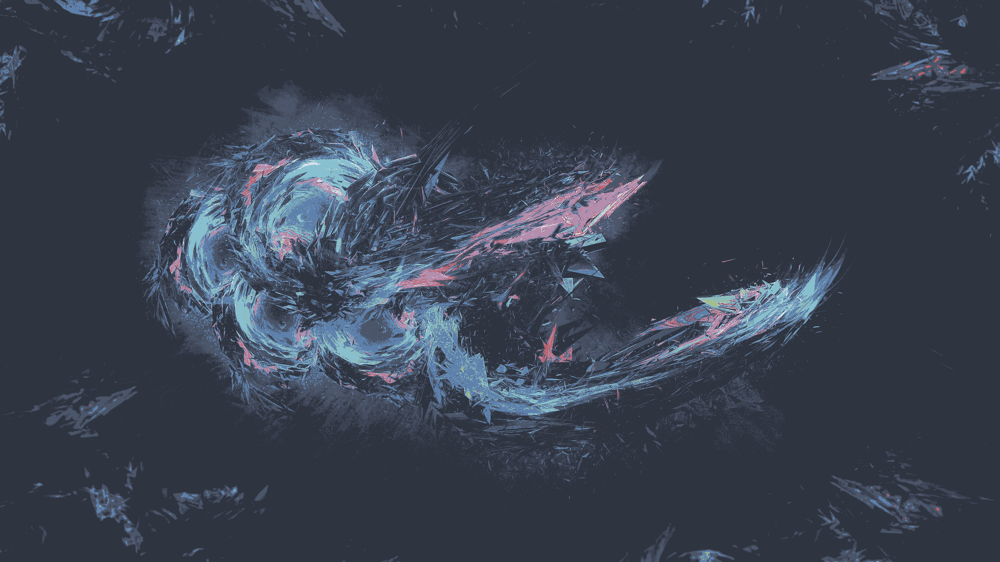 | [16.png](16.png) | 0.42 |
|  | [160.png](160.png) | 0.21 |
|  | [161.png](161.png) | 0.36 |
|  | [162.png](162.png) | 0.03 |
|  | [163.png](163.png) | 0.02 |
|  | [164.jpg](164.jpg) | 0.33 |
|  | [165.png](165.png) | 0.38 |
|  | [166.jpg](166.jpg) | 0.27 |
|  | [167.jpg](167.jpg) | 0.84 |
|  | [168.jpg](168.jpg) | 0.09 |
|  | [169.jpg](169.jpg) | 0.22 |
|  | [17.png](17.png) | 1.28 |
|  | [170.png](170.png) | 0.05 |
|  | [171.jpg](171.jpg) | 0.18 |
| 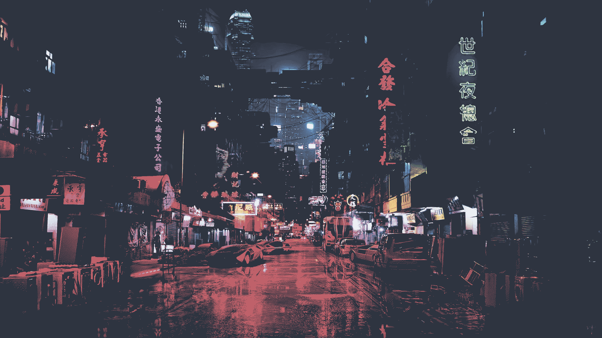 | [172.png](172.png) | 0.35 |
|  | [173.png](173.png) | 0.47 |
|  | [174.png](174.png) | 1.55 |
|  | [175.png](175.png) | 0.45 |
|  | [176.png](176.png) | 0.15 |
|  | [177.jpg](177.jpg) | 0.12 |
|  | [178.png](178.png) | 0.35 |
|  | [179.jpg](179.jpg) | 0.35 |
|  | [18.jpg](18.jpg) | 0.84 |
|  | [180.jpg](180.jpg) | 0.25 |
|  | [181.png](181.png) | 1.19 |
|  | [182.jpg](182.jpg) | 1.22 |
|  | [183.png](183.png) | 0.2 |
| 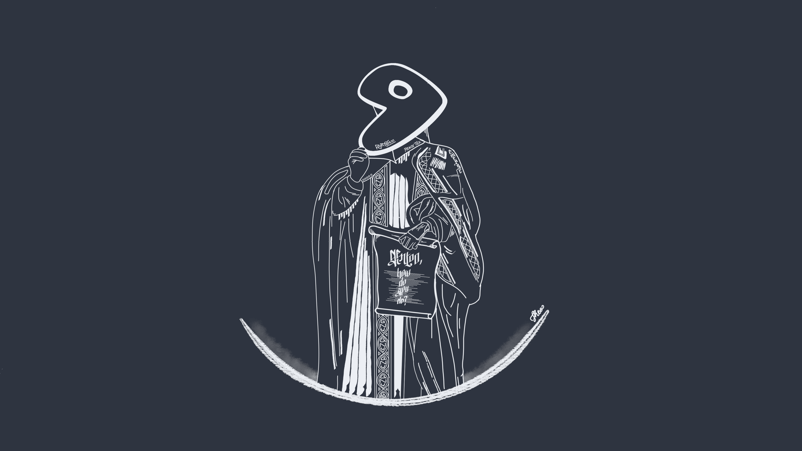 | [184.png](184.png) | 1.0 |
|  | [185.png](185.png) | 0.29 |
|  | [186.png](186.png) | 0.78 |
|  | [187.png](187.png) | 0.5 |
|  | [188.png](188.png) | 0.41 |
|  | [189.png](189.png) | 2.49 |
|  | [19.jpg](19.jpg) | 0.21 |
|  | [190.png](190.png) | 5.5 |
| 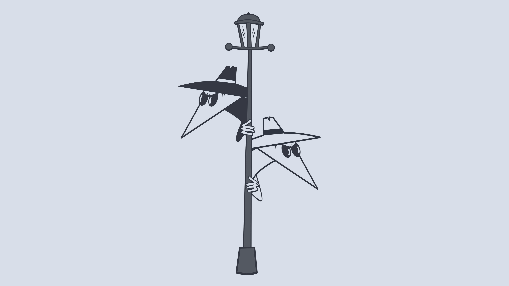 | [191.png](191.png) | 0.35 |
|  | [192.png](192.png) | 44.25 |
|  | [193.jpg](193.jpg) | 4.59 |
|  | [194.png](194.png) | 22.67 |
|  | [195.png](195.png) | 22.52 |
|  | [2.png](2.png) | 0.72 |
|  | [20.png](20.png) | 0.1 |
|  | [21.png](21.png) | 2.46 |
|  | [22.jpg](22.jpg) | 0.1 |
| 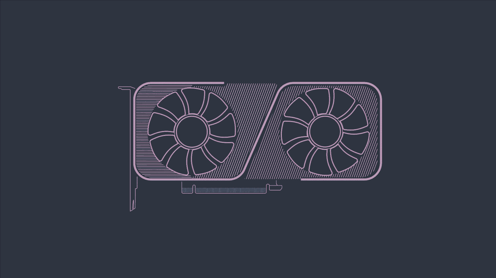 | [23.png](23.png) | 0.1 |
|  | [24.png](24.png) | 1.76 |
|  | [25.jpg](25.jpg) | 0.71 |
|  | [26.jpg](26.jpg) | 0.05 |
|  | [27.png](27.png) | 0.47 |
|  | [28.png](28.png) | 2.11 |
|  | [29.jpg](29.jpg) | 4.08 |
|  | [3.png](3.png) | 2.75 |
|  | [30.jpg](30.jpg) | 1.69 |
|  | [31.jpg](31.jpg) | 0.2 |
|  | [32.jpg](32.jpg) | 0.52 |
|  | [33.jpg](33.jpg) | 1.73 |
| 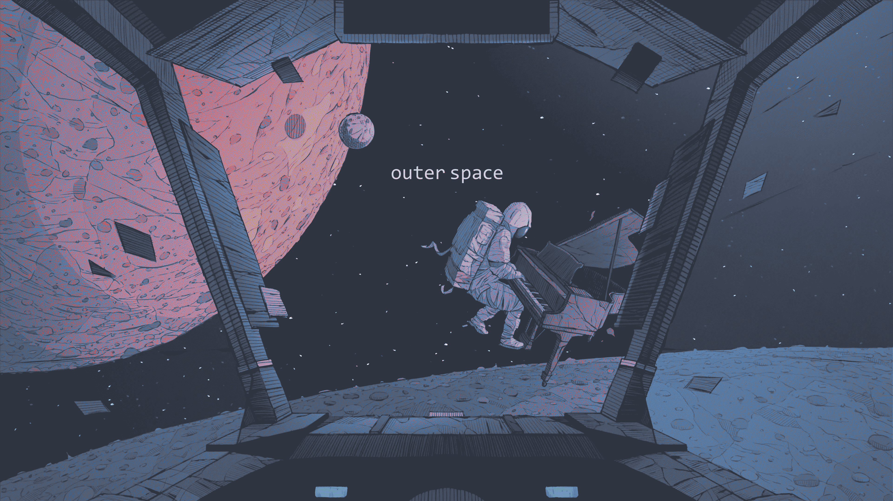 | [34.png](34.png) | 2.5 |
|  | [35.png](35.png) | 1.31 |
|  | [36.png](36.png) | 7.39 |
|  | [37.png](37.png) | 0.31 |
|  | [38.png](38.png) | 0.07 |
|  | [39.png](39.png) | 9.73 |
|  | [4.jpg](4.jpg) | 0.27 |
|  | [40.png](40.png) | 0.04 |
|  | [41.png](41.png) | 0.42 |
| 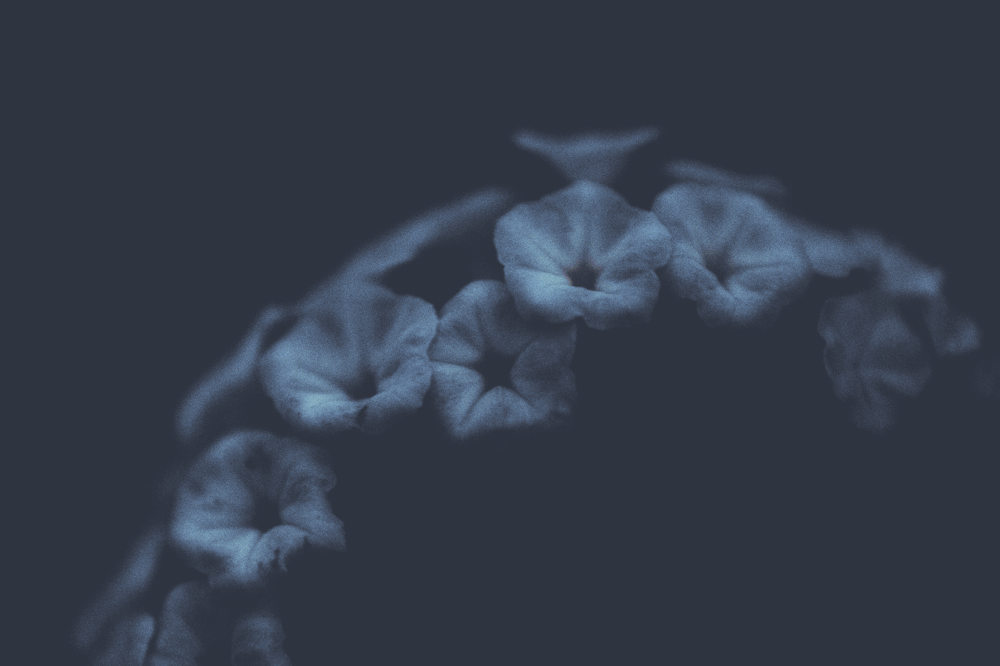 | [42.png](42.png) | 3.49 |
|  | [43.png](43.png) | 0.05 |
|  | [44.png](44.png) | 0.02 |
|  | [45.png](45.png) | 0.01 |
|  | [46.png](46.png) | 0.33 |
|  | [47.png](47.png) | 0.07 |
|  | [48.png](48.png) | 0.11 |
|  | [49.png](49.png) | 0.05 |
|  | [5.png](5.png) | 0.13 |
|  | [50.png](50.png) | 0.1 |
|  | [51.jpg](51.jpg) | 0.04 |
|  | [52.jpg](52.jpg) | 1.45 |
| 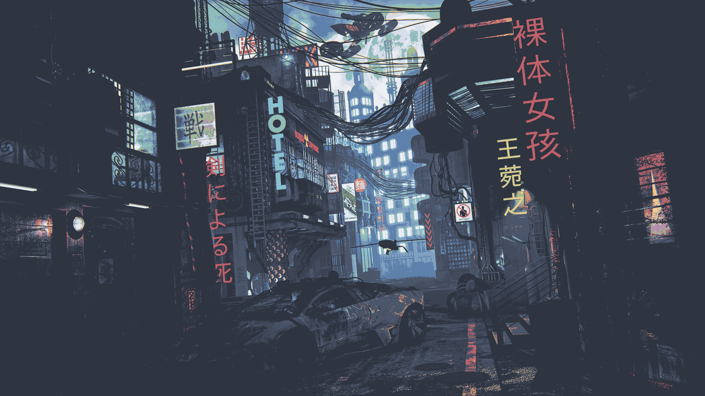 | [53.png](53.png) | 1.36 |
|  | [54.png](54.png) | 0.8 |
|  | [55.png](55.png) | 0.34 |
|  | [56.png](56.png) | 0.16 |
|  | [57.png](57.png) | 0.51 |
|  | [58.jpg](58.jpg) | 0.47 |
|  | [59.png](59.png) | 0.34 |
| 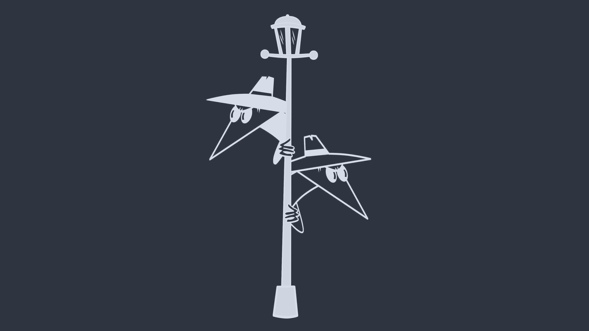 | [60.jpg](60.jpg) | 0.2 |
|  | [61.png](61.png) | 2.84 |
|  | [62.png](62.png) | 0.05 |
|  | [63.jpg](63.jpg) | 0.18 |
|  | [64.png](64.png) | 0.25 |
| 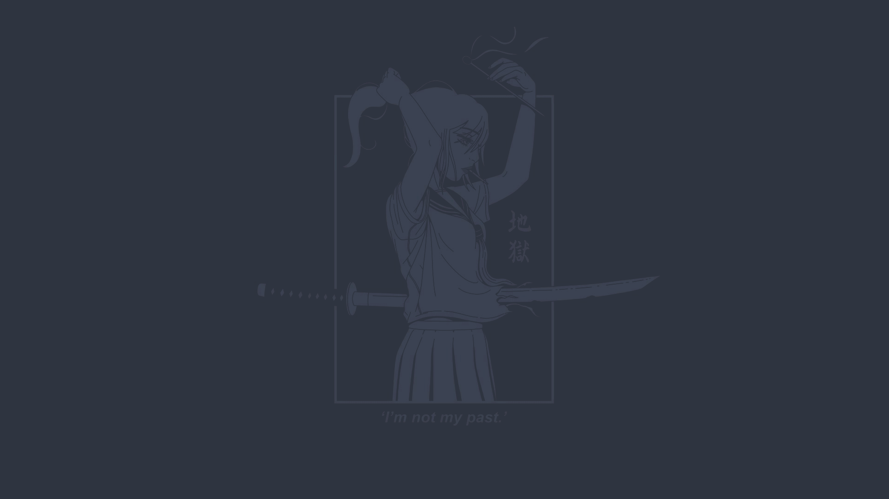 | [65.png](65.png) | 0.17 |
|  | [66.png](66.png) | 0.91 |
|  | [67.png](67.png) | 1.82 |
|  | [68.png](68.png) | 0.13 |
|  | [69.png](69.png) | 1.92 |
|  | [70.png](70.png) | 0.6 |
|  | [71.png](71.png) | 0.02 |
|  | [72.png](72.png) | 0.45 |
|  | [73.jpg](73.jpg) | 0.33 |
|  | [74.png](74.png) | 0.24 |
|  | [75.jpg](75.jpg) | 0.08 |
|  | [76.png](76.png) | 3.28 |
|  | [77.png](77.png) | 1.61 |
|  | [78.png](78.png) | 0.29 |
|  | [79.jpg](79.jpg) | 0.94 |
|  | [80.jpg](80.jpg) | 0.16 |
|  | [81.png](81.png) | 3.07 |
|  | [82.png](82.png) | 0.76 |
|  | [83.png](83.png) | 0.27 |
|  | [84.png](84.png) | 0.44 |
| 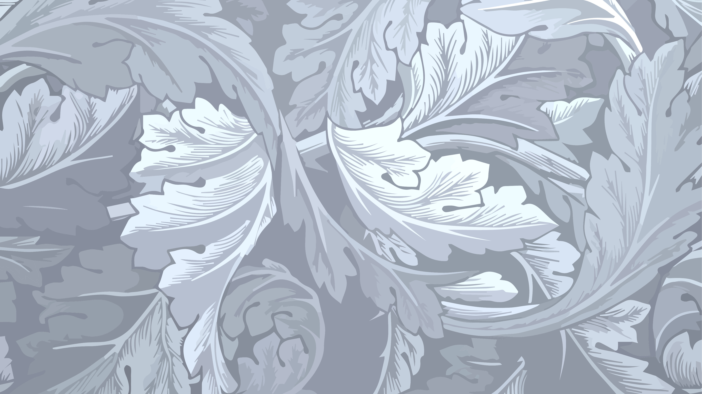 | [85.png](85.png) | 1.6 |
|  | [86.png](86.png) | 1.06 |
|  | [87.png](87.png) | 2.08 |
|  | [88.png](88.png) | 5.64 |
|  | [89.png](89.png) | 0.82 |
|  | [90.png](90.png) | 2.1 |
| 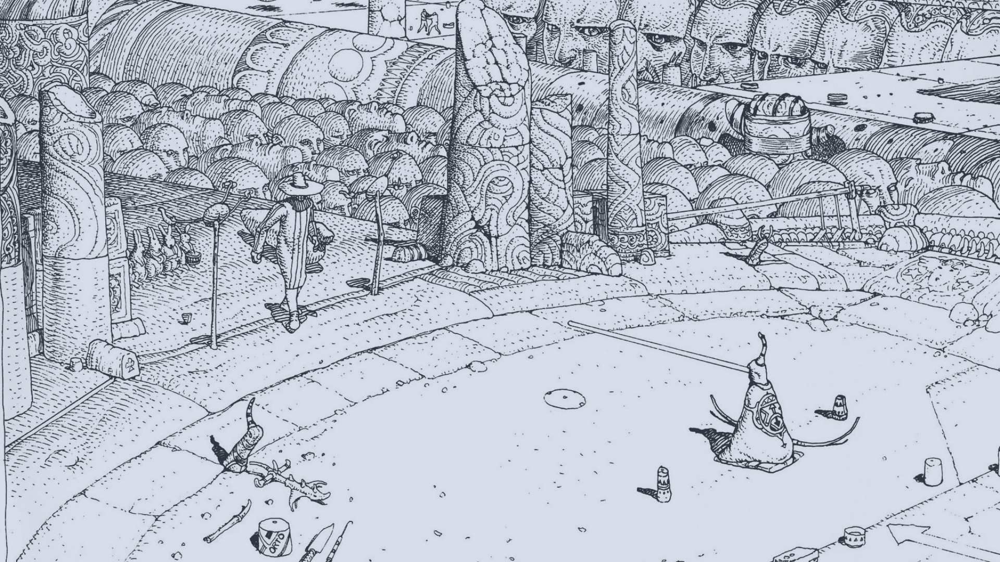 | [91.jpg](91.jpg) | 0.68 |
|  | [92.jpg](92.jpg) | 0.19 |
|  | [93.jpg](93.jpg) | 0.34 |
|  | [94.png](94.png) | 0.2 |
| 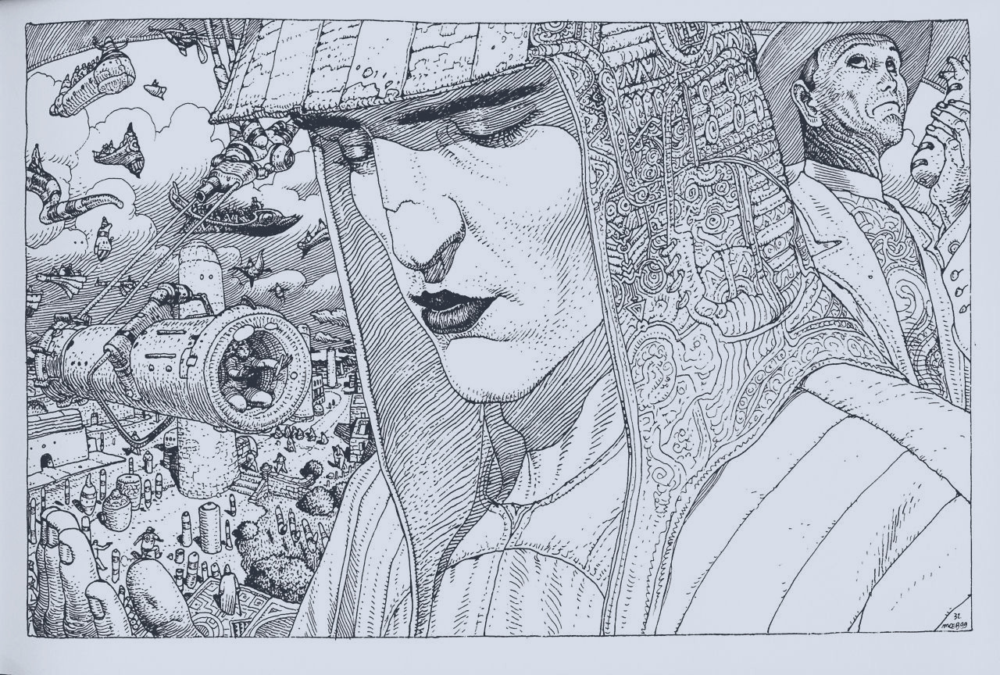 | [95.jpg](95.jpg) | 0.44 |
|  | [96.jpg](96.jpg) | 1.0 |
|  | [97.jpg](97.jpg) | 0.07 |
|  | [98.png](98.png) | 0.84 |
|  | [99.jpg](99.jpg) | 0.18 |

## 🔄 Update Information
- **Updated at:** 2025-05-12 09:50:02 UTC
- **Updated by:** [SpreadSheets600](https://github.com/SpreadSheets600)

---
Generated by [SpreadSheets600](https://github.com/SpreadSheets600)'s Wallpaper Collection Manager
